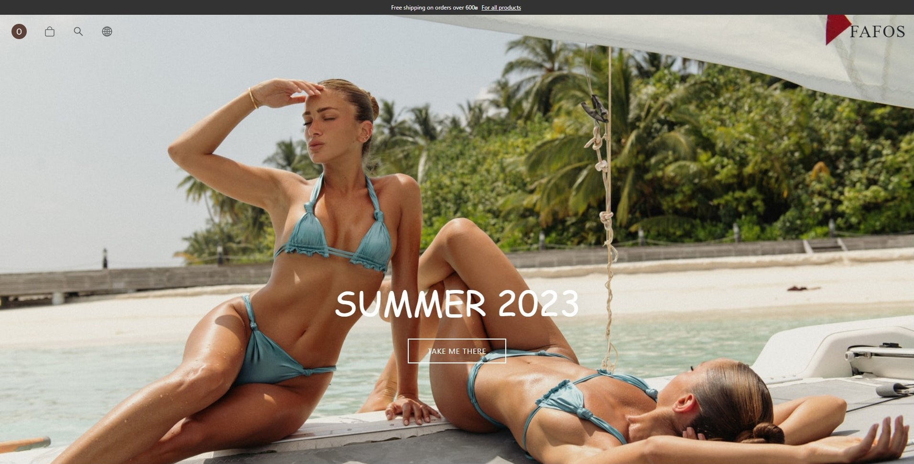
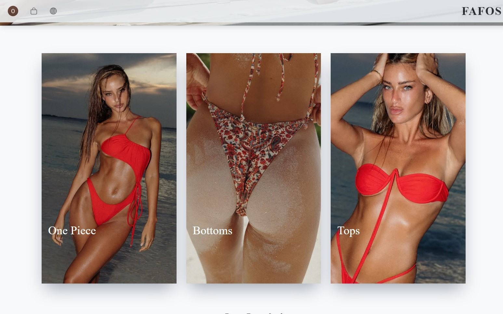
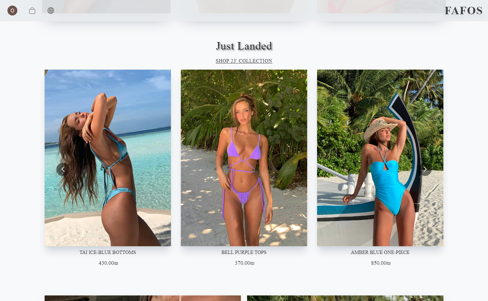
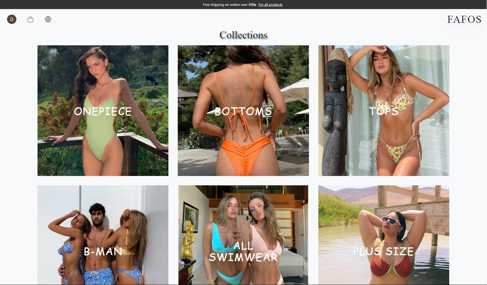
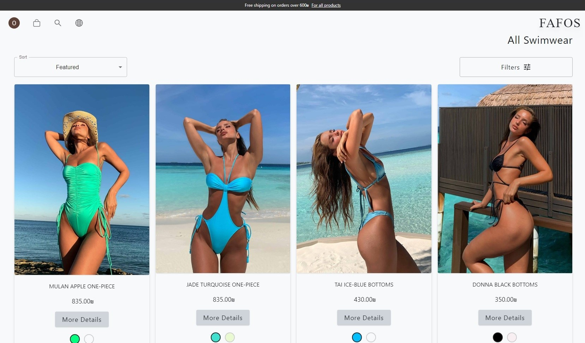
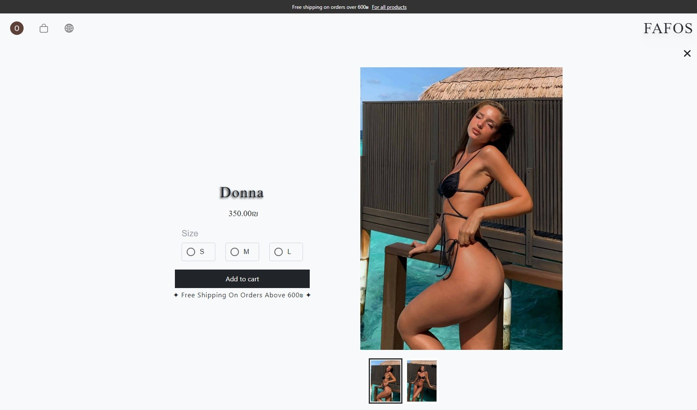
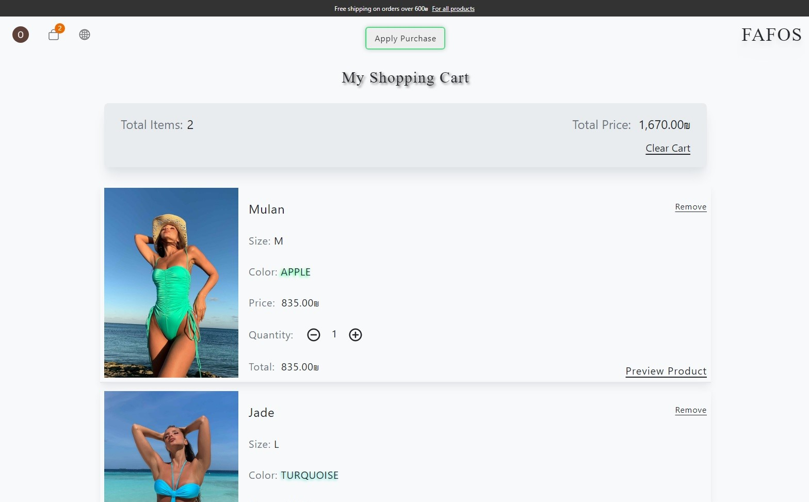
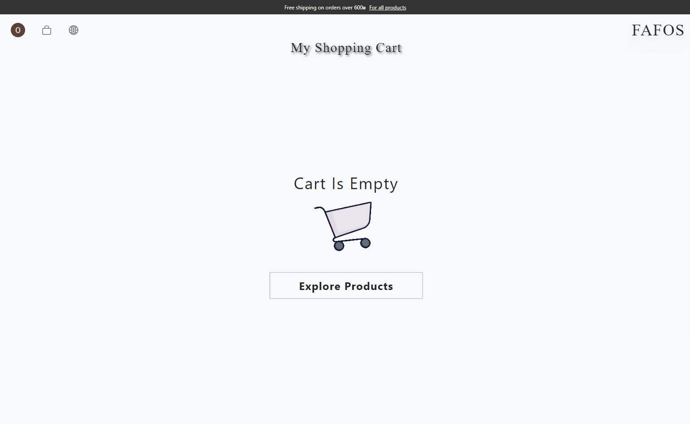
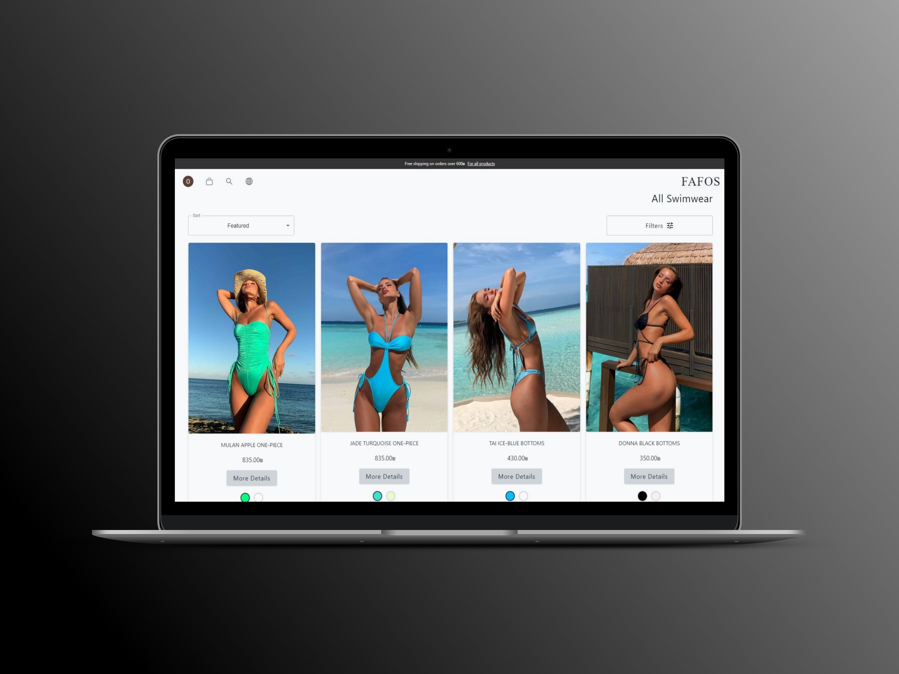
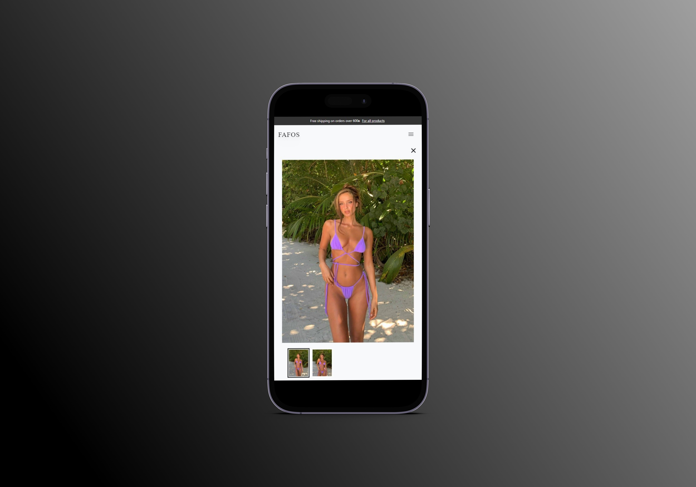

### Fafos - E-commerce for swimwear inspired by bananahot.com
Fafos is a swimwear store built using NextJS , [here is my project link](https://fafos-webshop.vercel.app/)



___

### Table of contents
- [Application Features](#application-features)
- [Technologies](#technologies)
- [Home Page](#home-page)
- [Collections Page](#collections-page)
- [Products Page](#products-page)
- [Product Page](#product-page)
- [Cart Page](#cart-page)
- [Login Page](#login-page)
- [Getting Started](#getting-started)

## Application Architecture
This web shop built with NextJS for Server Side Rendering, which upgrades the SEO (Search Engin Optimization), 
Using React and Typescript for the frontend including the best UI&UX tools and libraries like TailwindCSS, MUI, 
React-Multi-Carousel, React-loading-skeleton, Next-I18n, React-Toastify, Formik & Yup for forming and validation and more.
Advanced cart logic that is matches the inventory database, data matches the data structure of the products and saves the user picks in the local storage.
All the api requests and data fetching made with Axios including validations high security with the right middlewares, all the way to the MongoDB database.
User Authentication made with firebase that brings with him connecting with email & password, Google authentication and Facebook authentication.
This project was build with extra development tools like Docker, Eslint, and testing tools like Jest, Postman and shell scripts for database tests.

## Application Features
- Advanced and modern UI for searching and purchasing swimwear 
- Advanced cart logic that is matches the inventory database, data matches the data structure of the products and saves the user picks in the local storage.
- Admin panel for add, remove, update products. and also dashboard for sales review.
- Internationalization - I18n translate for the most popular languages.

## Technologies
React, Typescript, TailwindCSS and MUI for the Frontend side.
Next framework, MongoDB database and Restful API for Backend side.
Jest for Unit Testing, Selenium for end-to-end testing and Karma for Integration testing.
Morgan framework for Logging.
and more development tools like Docker, Cloudinary, Eslint, Postman and Mongo compass.

## Home Page
The landing page including hero, teasers, image carousel, hot categories and video sections.

#### Hero 


#### Teaser


#### Image-Carousel



## Collections Page
The collection page includes all the popular collections to choose



## Products Page
The products page includes products with filters and sorting features
** Every product is presented with color bullets that present the product in other colors if any. **



## Product Page
The product page includes more images of the chosen product, size choosing, add to cart button and relative products



## Cart Page
The cart page includes all the products that the user has been added



And for who's the cart is empty.. 


## Login Page
The login & sign up page includes login with Email & Password, login with Google, login with Facebook and Login with Apple for macOs, IOS systems.


## Some Mobile
This Project is a fully responsive for any device!







## Getting Started 

Head to the repository on top and clone the project 

```
git clone https://github.com/oferGavrilov/Fafos-webshop.git

```

Next, in the terminal:

```
cd ./Fafos-webshop
npm install & npm run dev

```
Remember to add your own enviorment variables and open your favorite browser on localhost:3000 and That's it!
if you have a problem please make contact me here [Gmail](https://mail.google.com/mail/?view=cm&fs=1&tf=1&to=ofergavri@gmail.com)

